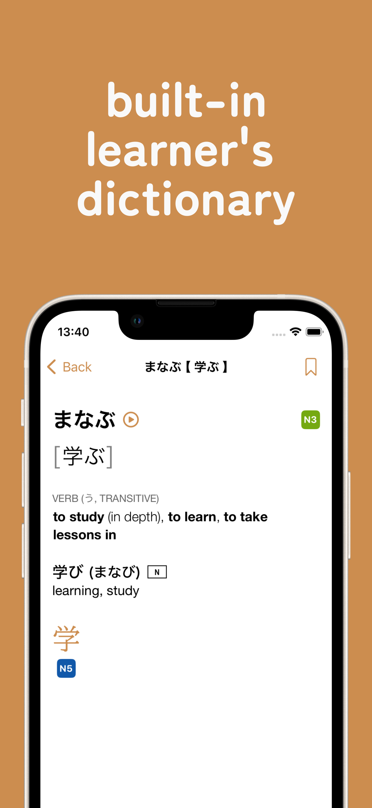
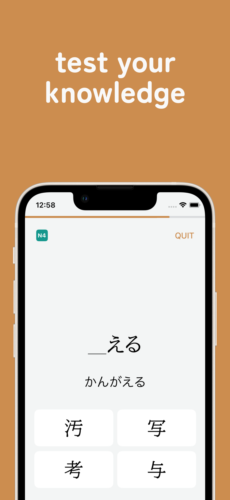
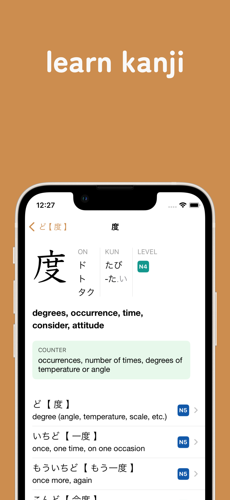
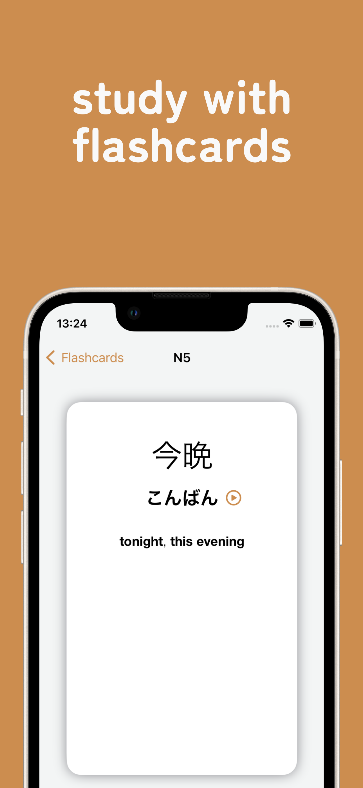

<picture>
  
</picture>

A free study tool for learners of the Japanese language.

<picture>
  
</picture>
<picture>
  
</picture>
<picture>
  
</picture>
<picture>
  
</picture>

## Key features

▣ **A learner's Japanese-English dictionary** 
A corpus of 8500 of the most common Japanese words and phrases. Containing simplified definitions and helpful information for students. 

▣ **A learner's Kanji dictionary** 
A corpus of 1700 of the most common kanji characters. Showing only the readings and meanings that you need to know, plus a list of the most common idioms that a kanji is used in.

▣ **Exercises** 
Improve reading comprehension by trying randomised questions generated from the dictionary on-the-fly. Choose the correct reading of a word written in kanji, or fill in the missing kanji in a word. 

▣ **Flashcards** 
Up your vocabulary knowledge by studying simple, unambiguous flashcards. You can check off words that you already know with one tap. 

▣ **JLPT index** 
All five levels of the Japanese Language Proficiency Test are covered. Every dictionary entry is marked with a JLPT level classification, so you know what you need to study first.[^1]

Plus:

* Over 4500 audio pronunciations, all recorded by native speakers.
* All features work offline.
* No account required.
* Completely free to use and ad-free.

## Download

Jelly Potato is only available for iPhone. Requires iOS 16.0.

Or scan the QR code:  

<picture>

</picture>

 Currently available in the following territories: 

Australia, Austria, Belgium, Canada, Croatia, Cyprus, Czechia, Denmark, Finland, Greece, Hong Kong, Iceland, Ireland, Japan, Luxembourg, Malaysia, Malta, Netherlands, Norway, Philippines, Portugal, Singapore, Slovakia, Slovenia, Sweden, United Kingdom

[^1]: There are currently no official JLPT vocabulary or kanji classification lists; the classifications for all entries are carefully-chosen estimates only.

---

For feedback, queries, bug reports etc., please send an email to `jellypotato AT icloud DOT com`

[Privacy Policy](privacypolicy.md)
