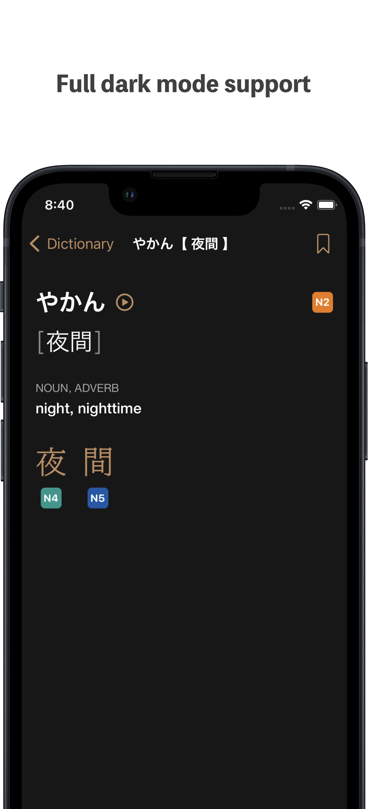
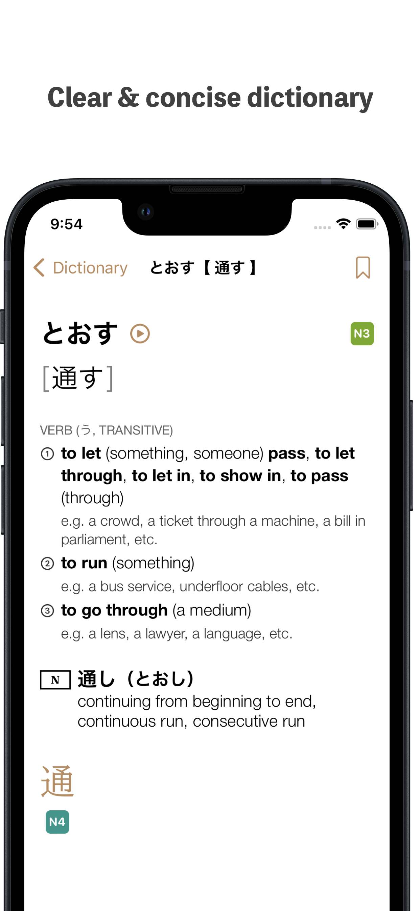
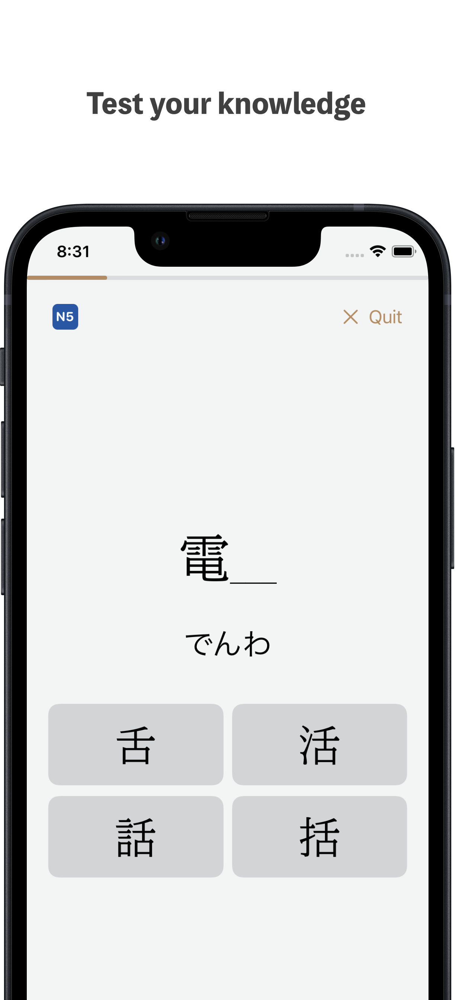
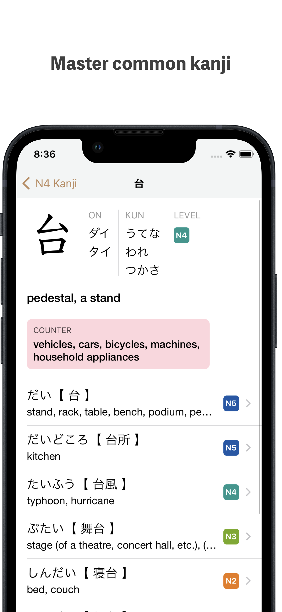

<picture>
  
</picture>

Brand new for 2023, **jellypotato** is a free study tool for learners of Japanese.

<picture>
  
</picture>
<picture>
  
</picture>
<picture>
  
</picture>
<picture>
  
</picture>

---

▣ **Exercises** - practice for the first section of the JLPT, which tests knowledge of words.
Choose the correct reading of the word, or fill in the missing kanji. 
All exercise questions are generated straight from the built-in dictionary on-the-fly - no need to worry about spelling mistakes or inaccuracies. 
Improve your Japanese reading ability quickly.

▣ **Flashcards** - simple and quick to use. No SRS systems, no pile-ups. Just study when you want, as much as you want.
The intelligent flashcard system shows extra information when the flashcard headword is ambiguous. 
Hide flashcards that you don't need to see anymore with a single tap.

▣ **Dictionary** - A Japanese-English dictionary carefully designed for learners. 
Only the most commonly-used 8500 words and expressions have been included, so you can be sure that whatever you see is used regularly by native Japanese speakers.
- Each dictionary entry has been carefully reviewed and edited to make sure it only has the most relevant information for learners of Japanese.
- The dictionary's smart search system places the most relevant results at the top.
- A kanji dictionary with only the most common 1700 kanji characters that will appear in the JLPT.[^1].
- Each kanji entry shows the most common words that the kanji appears in.
- All dictionary entries in the app have a JLPT level classification.[^1]

▣ **And more** - 
- Over 4500 audio pronunciations, all recorded by native speakers.
- Customisable - change fonts for more comfortable reading.
- Dark mode support.
- Works 100% offline.
- No account required.
- Completely free to use and ad-free.

[^1]: There are currently no official JLPT vocabulary or kanji classification lists; the classifications for all entries are carefully-chosen estimates only.

---

For feedback, queries, bug reports etc., please send an email to `jellypotato AT icloud DOT com`

[Privacy Policy](privacypolicy.md)
